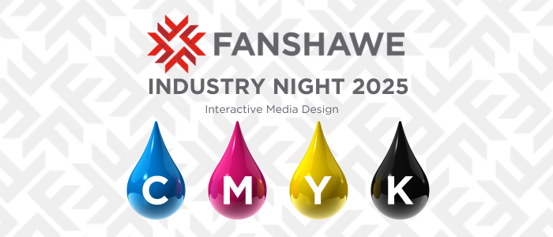

# Hackathon  - Fanshawe Industry Night 2025
The SDPA Industry Night for 2023 will showcase student projects and 
activities from the Interactive Media Design Program.
By Interactive Media Design & User Experience Design Program
School of Media & Design Arts

CMYK_student_showcase

## Installation

No installation is required. Simply download the files.

## Usage

Open the index file in your browser of choice.

## Contributing

1. Fork it!
2. Create your feature branch: `git checkout -b my-new-feature`
3. Commit your changes: `git commit -am 'Add some feature'`
4. Push to the branch: `git push origin my-new-feature`
5. Submit a pull request :D

## History
14 September 2024

## Credits
Creator:
C - Connie [KingYin Sham]
M - Mahaittidon [Mahaittidon Natchanon]
Y - YiTing [YiTing Lai Elaine]
K - Keith [Keith Lie]

## License
MIT - see license file for more information.
